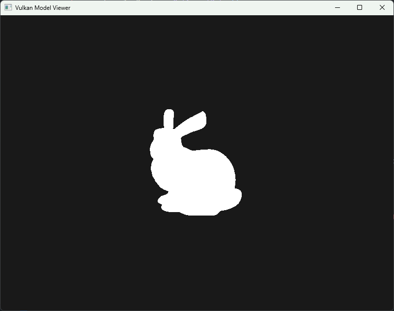

# Vulkan Model Viewer

A model viewer that supports a basic game loop with camera controls. Built with Vulkan and uses GLFW for windowing, GLM for vector math, and tinyobjloader for loading `.obj` files.

# Controls
**WASD** - Horizontal movement

**QE** - Vertical movement

**Arrow keys** - Rotate camera

# Example



# Building

```
mkdir build
cd build
cmake ../
make
```

Run the resulting executable.

# Resources
- [GLFW](https://github.com/glfw/glfw)
- [GLM](https://github.com/g-truc/glm)
- [tinyobjloader](https://github.com/tinyobjloader/tinyobjloader)
- [Brendan Galea YouTube Series](https://www.youtube.com/@BrendanGalea)